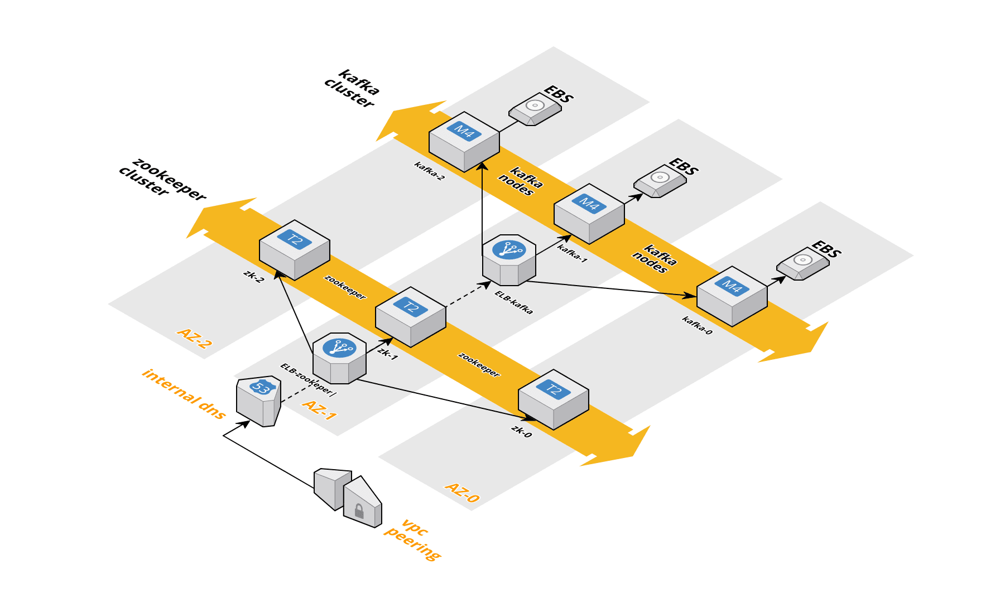

# Kafka Cluster on AWS

## Architecture Overview




## Directory Structure

```
├── modules         # terraform modules          
├── templates       # templates to launch new deployments
└── deployments     # deployments done based on templates+modules
```

## Modules

Terraform modules to create AWS resources:
* VPC Module
* Kafka Cluster Module


### VPC Module
This modules creates a VPC to host one or more Clusters
```
└── vpc
    ├── ec2-bastion.tf          # Bastion instance
    ├── gateways.tf             # Internet and NAT Gateways 
    ├── inputs.tf               # Input variables for the module
    ├── outputs.tf              # Outputs variables for the module
    ├── peering.tf              # Peering setup with connecting VPC 
    ├── secgroups.tf            # Security Groups 
    ├── subnets.tf              # Base Public Subnets for the VPC
    ├── terraform.tf            # Terraform version requirement
    └── vpc.tf                  # VPC creation
```
### How to create a new VPC
Hint: the S3 bucket needs to exist upfront!

#### Create VPC for an Environment - with Ansible

##### Scaffold the deployment directories

Run Ansible Playbook on the root directory
```
ansible-playbook playbook.yml
``` 

Answer to the questions:
```
Environment : development
Deployment ID : dev-00
```  

This will create the deployments directories as:
```
deployments
├── development
│   ├── dev-00
│   └── vpc
``` 

For the environment, integration or production, if the VPC still does not exists, it will create  it.

##### Check Terraform configuration

Check terraform state configuration
```
cat provider.tf
```

Check terraform deplyoment variables
```
cat terraform.tfvars
```

##### Run Terraform on the Deployment 

Run Terraform plan

```
terraform plan
```

Once confirmed the changes, apply:
```
terraform apply
```


#### Create VPC for an Environment - Step-by-Step

Create new directory for the new environment:
```
mkdir deployment/integration/vpc
cd deployment/integration/vpc
```

Initialize terraform with template:
``` 
terraform init -from-module="../../../templates/vpc"
```

Customize variables for VPC creation on _terraform.tfvars_:
```
vpc_cidr="172.16.0.0/16"
vpc_peer="vpc-88c0bde0" //VPC where Kubernetes runs
domain="some.domain"
name="integration"
```

Change on _provider.tf_ the S3 bucket and key where terraform state is going to be stored on S3:
```
terraform {
  backend "s3" {
    bucket = "terraform.integration.some.domain"
    key    = "integration/vpc/terraform.tfstate"
    region = "eu-central-1"
    encrypt = true
  }
}
```

Create VPC:

```
terraform validate  # validate any syntax errors
terraform plan      # see resources to be created
terraform apply
```


### Kafka Cluster Module

```
modules
├── kafka-cluster
│   ├── configs                     # Configuration files of kafka and zookeeper
│   ├── datasources.tf              # Data source
│   ├── dns.tf                      # DNS records 
│   ├── inputs.tf                   # Input Variables
│   ├── kafka-configuration.tf      # Kafka Configuration
│   ├── kafka-ebs.tf                # EBS Volumes
│   ├── kafka-ec2.tf                # EC2 kafka nodes creation
│   ├── outputs.tf                  # Output Variables
│   ├── subnets.tf                  # Subnets for this cluster
│   ├── user_data                   # Directory with Cloud-Init scripts
│   ├── zookeeper-configuration.tf  # Zookeeper Configuration
│   └── zookeeper-ec2.tf            # Zookeeper EC2 Instance Creation
```

### How to create a new Kafka Cluster

> NOTE: VPC must already exists. See VPC Creation above.

This module creates an aws-region-distributed kafka cluster with separated zookeeper modules and separated kafka nodes.

#### Create Deployment Environment for Kafka Cluster

Create new directory for the new cluster:

```
mkdir deployment/integration/dev-00
cd deployment/integration/dev-00
``` 

Initialize terraform with a template:
```
terraform init -from-module="../../../templates/kafka-cluster"
```

Customize environment variables:
```
// -------------
// provider.tf
// -------------
key    = "integration/dev-00/terraform.tfstate"


// -------------
// terraform.tfvars
// -------------
# Subnets and its CIDRS are incremented by the number of AZs 0,3,6,...
stack_offset=0  ## IMPORTANT to not overlap subnet CIDRS

# Environment Name
env="dev"
domain="integration.some.domain"


# Define Kafka EC2 Instance and Disk Sizes
kafka_ec2_type="m4.xlarge"
kafka-disksize=500
kafka-disktype="st1"
```

Run Terraform:
```
terraform validate  # validate any syntax errors
terraform plan      # see resources to be created
terraform apply
```


## Kafka configuration options

This is a brief explanation of the most important options that were applied to Kafka and differ from the default.

### How to create (edit,...) topics on Kafka

In order to manage the topics of the Kafka cluster you must connect to any of the Kafka borkers.
Please follow the instructions below to achieve this.

Once connected, you are able to utilize the kafka CLI tools, for instance `kafka-topics`.
Documentation is available for instance [here](https://kafka.apache.org/quickstart).

The default script that is used to create all required topics with the appropriate settings is [this file](./scripts/kafka/create-topics-externalkafka.sh).

#### Bastion Host

The [bastion host](https://en.wikipedia.org/wiki/Bastion_host) is the single entry point into this cluster from the internet.
Access is restricted through AWS security groups. If you want to connect to this bastion host, you must:

1. Whitelist your IP within the kafka bastion host inbound rules.

2. Download [the required private key](https://s3.eu-central-1.amazonaws.com/terraform.integration.some.domain/keys/kafka-dev.pem) from AWS and save it as `~/.ssh/kafka-0144.pem`.
3. Update your SSH config to contain the following aliases:
```
Host bastion-integration-kafka
  Hostname ec2-52-57-246-157.eu-central-1.compute.amazonaws.com
  User centos
  IdentityFile ~/.ssh/kafka-0144.pem
  AddKeysToAgent yes
  ForwardAgent yes
  IdentitiesOnly yes
  StrictHostKeyChecking no

Host kafka.dev
  Hostname kafka.dev-00.integration.some.domain
  User centos
  ProxyCommand ssh -q -W %h:%p bastion-integration-kafka

Host zk.dev
  Hostname zk-0.dev-00.integration.some.domain
  User centos
  ProxyCommand ssh -q -W %h:%p bastion-integration-kafka

Host kafka.test
  Hostname kafka.test.integration.some.domain
  User centos
  ProxyCommand ssh -q -W %h:%p bastion-integration-kafka
```

*Please note that the IP addresses of the hosts will change after reboots! You can look them up in the AWS EC2 instance dashboard.*

### Mirrormaker

[Mirrormaker documentation by Confluence](https://docs.confluent.io/current/multi-dc/mirrormaker.html)
[Mirrormaker documentation by Kafka](https://cwiki.apache.org/confluence/pages/viewpage.action?pageId=27846330)

### Kafka Connect

[Kafka Connect documentation by Confluence](https://docs.confluent.io/current/connect/intro.html)

### zookeeper.properties

```
# data must stored at /zookeeper, as this is where we mount the EBS volume of AWS to.
# otherwise all data would be lost after the first reboot
dataDir=/zookeeper/data
dataLogDir=/zookeeper/log

# zoo servers
# these hostnames such as `zk-1` come from the /etc/hosts file
server.0=zk-0.${ENV}.${DOMAIN}:2888:3888
server.1=zk-1.${ENV}.${DOMAIN}:2888:3888
server.2=zk-2.${ENV}.${DOMAIN}:2888:3888

# We do want to allow the use SASL for client authentication
authProvider.1=org.apache.zookeeper.server.auth.SASLAuthenticationProvider

# The communication amonst different Zookeeper instances must use SASL authentication
quorum.auth.enableSasl=true
quorum.auth.learnerRequireSasl=true
quorum.auth.serverRequireSasl=true
```

### kafka.properties

```
# This list of listeners defines what prototocols Kafka shall support. In this example Kafka would accept PLAINTEXT, SASL, SSL and SASL_SSL
# If you want to disable a protocol, just remove it from the two options below.
advertised.listeners=PLAINTEXT://kafka-${BROKER_ID}.${ENV}.${DOMAIN}:9092,SASL_PLAINTEXT://kafka-${BROKER_ID}.${ENV}.${DOMAIN}:9093,SSL://kafka-${BROKER_ID}.${ENV}.${DOMAIN}:9094,SASL_SSL://kafka-${BROKER_ID}.${ENV}.${DOMAIN}:9095
listeners=PLAINTEXT://:9092,SASL_PLAINTEXT://:9093,SSL://:9094,SASL_SSL://:9095

# This defines how brokers communicate amongst each other
# Please note that we are encouraged to encrypt all connections, even within the cluster
security.inter.broker.protocol=SASL_PLAINTEXT
sasl.enabled.mechanisms=PLAIN
sasl.mechanism.inter.broker.protocol=PLAIN


# Kafka RACK awareness, this is bound to AWS region
# This option will force kafka to spread the replicas of a topic-partition over multiple racks, so that in case of failure there is always another replica available
broker.rack=${REGION}

# Must be set to true, otherwise you are not able to deleted topics at all
delete.topic.enable=true

# A comma seperated list of directories under which to store log files
# In this case, the log refers to the persistent data and NOT application logging
log.dirs=/kafka/data

# The default number of log partitions per topic. More partitions allow greater parallelism for consumption, but this will also result in more files across
# the brokers. There is a recommendation by Confluence not to have more than 4000 partitions per broker overall, as the performance then starts to become very poor.
num.partitions=8
# we will have 3 brokers so the default replication factor should be 3
default.replication.factor=3
# number of ISR to have in order to minimize data loss
# ISR explanation can be found here: https://cwiki.apache.org/confluence/display/KAFKA/Kafka+Replication
min.insync.replicas=2

# You do want to periodically flush your data, as otherwise this could be a cause for data loss.
# One should not set this interval to flush only after x messages, as this would also mean to have higher chances of loosing data
log.flush.interval.ms=86400000

# Zookeeper connection string (see zookeeper docs for details).
# This is a comma separated host:port pairs, each corresponding to a zk
# server. e.g. "127.0.0.1:3000,127.0.0.1:3001,127.0.0.1:3002".
# You must append the optional chroot string `/kafka` to the urls to specify the
# root directory for all kafka znodes.
zookeeper.connect=zk-0.${ENV}.${DOMAIN}:2181,zk-1.${ENV}.${DOMAIN}:2181,zk-2.${ENV}.${DOMAIN}:2181/kafka

# Topics will not be created automatically. This prevents topics that will be created witht the wrong partition / replication information
auto.create.topics.enable=false
```
